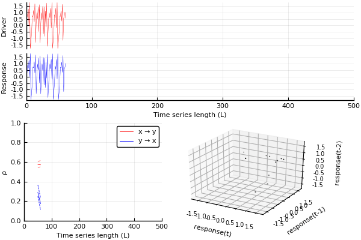

# Overview: convergent cross mapping (CCM)

The convergent cross mapping (CCM) algorithm [^1] measures
how well a [delay embedding](../../glossary/embed.md) of a putative response time series
is able to predict a putative driver time series. The prediction skill is then taken
as the unidirectional coupling strength from the driver to the response time series.
One may also compute lagged CCM [^2] by tuning the `ν` parameter.

The following cross mapping estimators are implemented.

- [`crossmap`](crossmapping.md). Cross map for time series of fixed length. This algorithm can implicitly say something about convergence by adjusting the library size.
- [`convergentcrossmap`](convergentcrossmapping.md). Explicitly cross map over multiple time series lengths. This is the approach introduced in [^1].

## Example

In the animation below, we're cross mapping for increasing time series length for a
[undirectionally set of coupled Henon maps](@ref henon2d) where `x`
drives `y`. As expected from the underlying coupling, the cross mapping skill in the
direction `x → y` converges at a higher value than in the opposite direction.

## Related software

- **[CauseMap.jl](https://github.com/cyrusmaher/CauseMap.jl)** also provides an implementation of the CCM algorithm, but this package has not been updated since 2015.

[^1]:
    Sugihara, G., May, R., Ye, H., Hsieh, C. H., Deyle, E., Fogarty, M., & Munch, S. (2012). Detecting causality in complex ecosystems. Science. [https://doi.org/10.1126/science.1227079](https://doi.org/10.1126/science.1227079)
[^2]:
    Ye, H., Deyle, E. R., Gilarranz, L. J., & Sugihara, G. (2015). Distinguishing time-delayed causal interactions using convergent cross mapping. Scientific Reports. [https://doi.org/10.1038/srep14750](https://doi.org/10.1038/srep14750)
