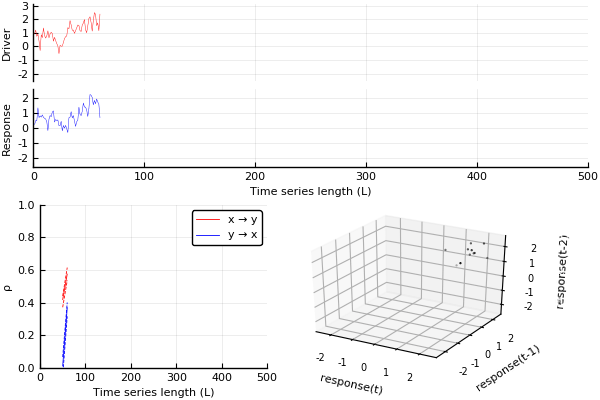

Visualise the convergent cross mapping algorithm for a realisation of the [`ar1`](../../example_systems/ar1.md) system.
The source code for and a description of the `make_ccm_gif` function can be found [here](ccm_gif.md).

```julia
sys_ar1 = CausalityTools.Systems.ar1()
tra = trajectory(sys_ar1, 1000-1)
x, y = tra[:, 1], tra[:, 2]
ts_lengths = 50:10:500

make_ccm_gif(x, y, ts_lengths)
```


