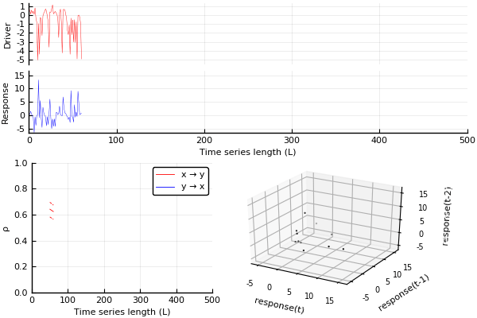

Visualise the convergent cross mapping algorithm for a realisation of the [`linear3d_nonlinearcoupling`](../../example_systems/linearmap3d_nonlinearcoupling.md) system.
The source code for and a description of the `make_ccm_gif` function can be found [here](ccm_gif.md).

```julia
sys_linear3d = CausalityTools.Systems.linear3d_nonlinearcoupling()
tra = trajectory(sys_linear3d, 1000-1)
x1, x3 = tra[:, 1], tra[:, 3] # NB x1 -> x3. Sidesteps x2.
ts_lengths = 50:10:500

make_ccm_gif(x1, x3, ts_lengths)
```


