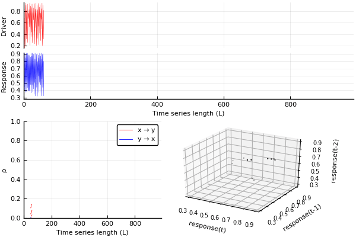

Visualise the convergent cross mapping algorithm for a realisation of the [`logistic2`](../../example_systems/logistic2.md) system.
The source code for and a description of the `make_ccm_gif` function can be found [here](ccm_gif.md).

```julia
sys_logistic2 = CausalityTools.Systems.logistic2()
tra = trajectory(sys_logistic2, 1000-1)
x, y = tra[:, 1], tra[:, 2]
ts_lengths = 50:10:990

make_ccm_gif(x, y, ts_lengths)
```


