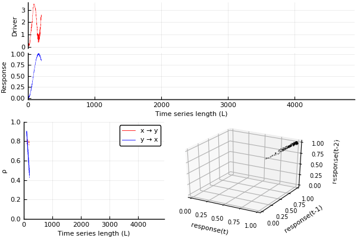

Visualise the convergent cross mapping algorithm for a realisation of the [`verdes`](../../example_systems/verdes.md) system.
The source code for and a description of the `make_ccm_gif` function can be found [here](ccm_gif.md).


```julia
sys_verdes = CausalityTools.Systems.verdes()
tra = trajectory(sys_verdes, 5000-1)
x, y = tra[:, 1], tra[:, 2]
ts_lengths = 100:100:4900

make_ccm_gif(x, y, ts_lengths)
```


