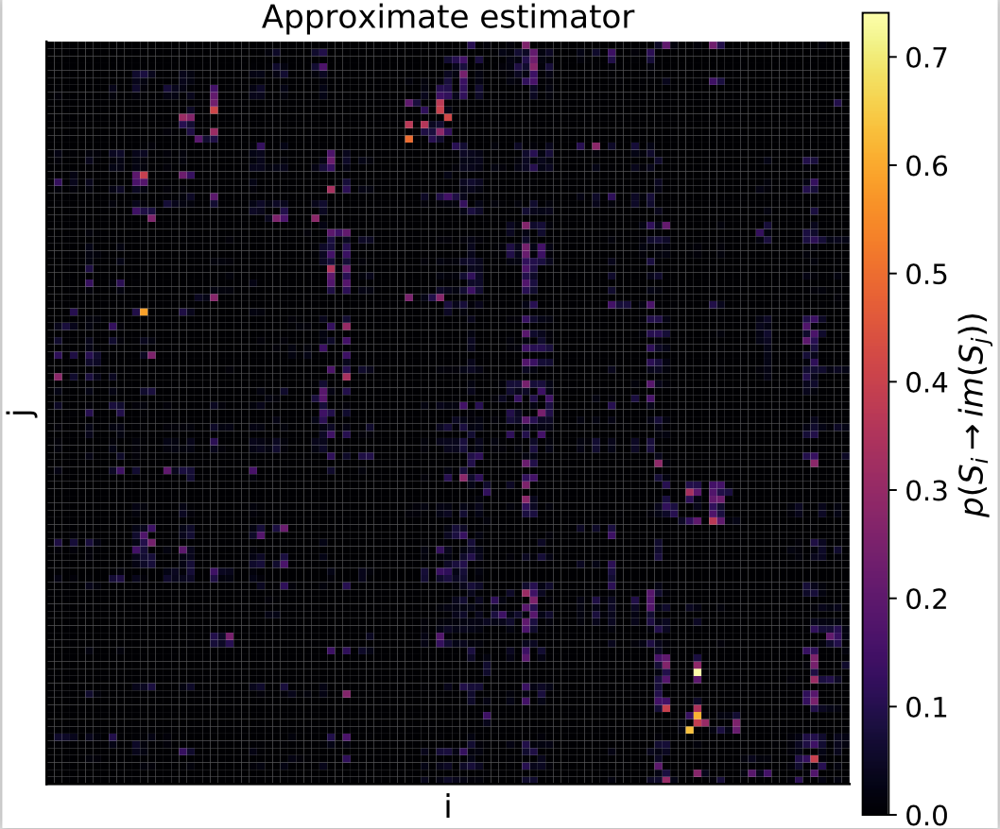

# Approximate estimator

The approximate estimator computes intersections between simplices by a point sampling
of the simplices. Intersections are estimated by counting the number of overlapping points
between simplices. This method is about an order of magnitude faster than the exact
estimator, and should be used for small-to-moderate sized datasets in the order of
hundreds of data points. For larger data sets, use a rectangular estimator.


```julia
# Create some random points and make sure they are invariant
pts = [rand(3) for i = 1:30]
invariant_pts = invariantize(pts)

# Compute the transfer operator
to = transferoperator_triangulation_approximate(invariant_pts, n_sample_pts = 200)

plot(to)
```



