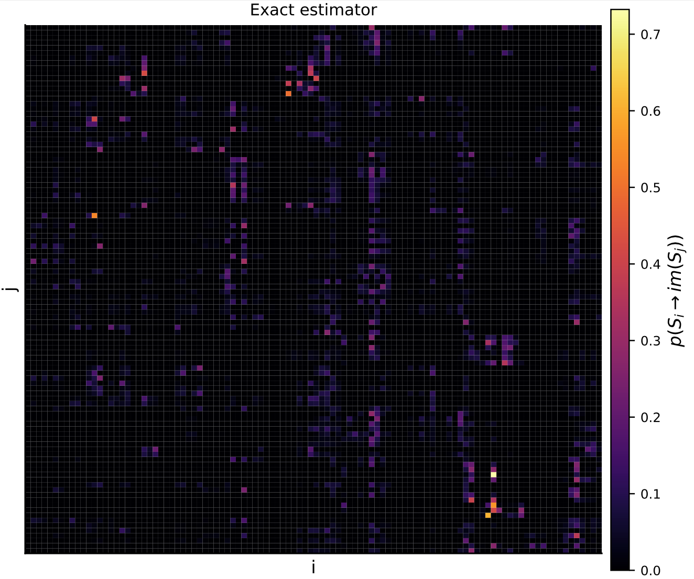

# Exact estimator

The exact estimator computes intersections between simplices exactly. It uses a method of boundary triangulation to compute the intersecting volume, and the runtime for this algorithm grows exponentially with increasing dimension. The exact estimator is the slowest, but yields the most accurate results (given your data).


```julia
# Create some random points and make sure they are invariant
pts = [rand(3) for i = 1:30]
invariant_pts = invariantize(pts)

# Compute the transfer operator
to = transferoperator_triangulation_exact(invariant_pts)

plot(to)
```


