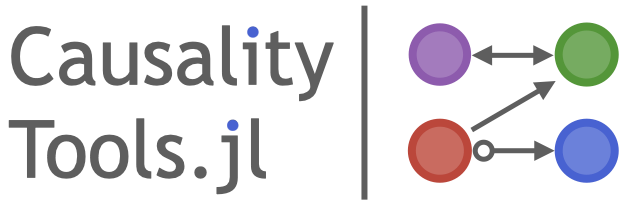

# CausalityTools.jl



```@docs
CausalityTools
```
## Documentation content 

- [Association measures](@ref).
- [Tutorials](@ref).

### Independence testing

For practical applications, it is often useful to determine whether variables are independent, possible conditioned upon 
another set of variables. One way of doing so is to utilize an 
association measure, and perform some sort of randomization-based
[independence testing](@ref independence_testing).

For example, to test the dependence between time series, [time series surrogates testing](https://github.com/JuliaDynamics/TimeseriesSurrogates.jl) is used. Many other frameworks for independence exist too. Here, we've collected some independence testing frameworks, and made sure that they are compatible with as many of the implemented association measures as possible.

<!--
## Goals

Causal inference, and quantification of association in general, is fundamental to
most scientific disciplines. There exists a multitude of bivariate and multivariate
association measures in the scientific literature. However, beyond the most basic measures,
most methods aren't readily available for practical use. Most scientific papers don't
provide code, which makes reproducing them difficult or impossible, without
investing significant time and resources into deciphering and understanding the original
papers to the point where an implementation is possible. To make reliable inferences,
proper independence tests are also crucial.

Our main goal with this package is to provide an easily extendible library of
association measures, a as-complete-as-possible set of their estimators.
We also want to lower the entry-point to the field of association
quantification, independence testing and causal inference, by providing well-documented
implementations of literature methods with runnable code examples.
We also provide an extendible API for bi- or multivariate information measures 
(which we here pragmatically define as measures that are functionals of probability 
mass functions or probability densitites).

The core function for quantifying associations is [`independence`](@ref),
which performs either a parametric or nonparametric (conditional)
[`IndependenceTest`](@ref) using some form of
[association measure](@ref association_measure). These tests, in turn, can be
used with some [`GraphAlgorithm`](@ref) and [`infer_graph`](@ref) to infer causal graphs.
-->
## Input data

Input data for CausalityTools are given as:

- Univariate *timeseries*, which are given as standard Julia `Vector`s.
- Multivariate timeseries, *StateSpaceSets*, or *state space sets*, which are given as
    [`StateSpaceSet`](@ref)s. Many methods convert *timeseries* inputs to [`StateSpaceSet`](@ref)
    for faster internal computations.
- Categorical data can be used with [`ContingencyMatrix`](@ref) to compute various
    information theoretic measures and is represented using any iterable whose elements
    can be any arbitrarily complex data type (as long as it's hashable), for example
    `Vector{String}`, `{Vector{Int}}`, or `Vector{Tuple{Int, String}}`.

```@docs
StateSpaceSet
```

## Pull requests and issues

This package has been and is under heavy development. Don't hesitate to submit an
issue if you find something that doesn't work or doesn't make sense, or if there's
some functionality that you're missing.
Pull requests are also very welcome!

## Maintainers and contributors

The CausalityTools.jl software is maintained by
[Kristian Agasøster Haaga](https://github.com/kahaaga), who also curates and writes this
documentation. Significant contributions to the API and documentation design has been
made by [George Datseris](https://github.com/Datseris), which also co-authors
[ComplexityMeasures.jl](https://github.com/JuliaDynamics/ComplexityMeasures.jl), which
we develop in tandem with this package.

A complete list of contributors to this repo are listed on the main Github page. Some
important contributions are:

- [Norbert Genera](https://github.com/norbertgerena) contributed bug reports and
    investigations that led to subsequent improvements for the pairwise asymmetric
    inference algorithm and an improved cross mapping API.
- [David Diego](https://www.researchgate.net/profile/David-Diego)'s contributions were
    invaluable in the initial stages of development. His MATLAB code provided the basis
    for several transfer entropy methods and binning-related code.
- [George Datseris](https://github.com/Datseris) also ported KSG1 and KSG2 mutual
    information estimators to Neighborhood.jl.
- [Bjarte Hannisdal](https://github.com/bhannis) provided tutorials for mutual information.
- Tor Einar Møller contributed to cross-mapping methods in initial stages of development.

Many individuals has contributed code to other packages
in the [JuliaDynamics](https://juliadynamics.github.io/JuliaDynamics/) ecosystem which
we use here. Contributors are listed in the respective GitHub repos and webpages.

## Related packages

- [TransferEntropy.jl](https://github.com/JuliaDynamics/TransferEntropy.jl) previously
    provided mutual infromation and transfer entropy estimators. These have been
    re-implemented from scratch and moved here.
