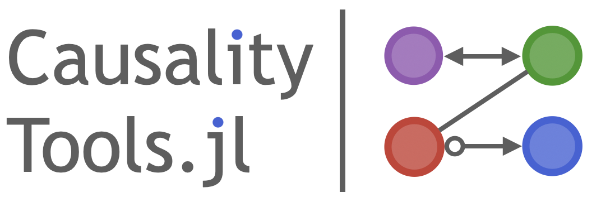

`CausalityTools` is a Julia package that provides algorithms for *detecting
dynamical influences* and *causal inference* based on time series data, and other
commonly used measures of dependence and association.

!!! info
    You are reading the development version of the documentation of
    CausalityTools.jl that will become version 2.0.

## Content

The goal of CausalityTools.jl is to provide an easily extendable library of univariate,
bivariate and multivariate measures of complexity, association and (directional) dependence between data of various kinds. We currently offer:

- A suite of [information measures](@ref information_measures), such as
    [`mutualinfo`](@ref), [`condmutualinfo`](@ref) and [`transferentropy`](@ref),
    along with a plethora of estimators for computation of discrete and
    continuous variants of these measures.
- A generic [cross-map](@ref cross_mapping_api) interface for causal inference methods
    based on state space prediction methods. This includes
    measures such as [`ConvergentCrossMapping`](@ref) and
    [`PairwiseAsymmetricInference`](@ref).

Other measures are found in the menu.

## Input data

Input data for CausalityTools are given as:

- Univariate *timeseries*, which are given as standard Julia `Vector`s.
- Multivariate timeseries, *datasets*, or *state space sets*, which are given as
    [`Dataset`](@ref)s. Many methods convert *timeseries* inputs to [`Dataset`](@ref)
    for faster internal computations.
- Categorical data can be used with [`ContingencyMatrix`](@ref) to compute various
    information theoretic measures and is represented using any iterable whose elements
    can be any arbitrarily complex data type (as long as it's hashable), for example
    `Vector{String}`, `{Vector{Int}}`, or `Vector{Tuple{Int, String}}`.

```@docs
Dataset
```

!!! info
    This package has been and is under heavy development. Don't hesitate to submit an
    issue if you find something that doesn't work or doesn't make sense, or if there's
    some functionality that you're missing.
    Pull requests are also very welcome!
