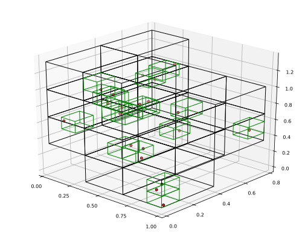

# Invariant measure estimation

## Rectangular grid, measure at final resolution induced by some other resolution

`inducedrectangularinvariantmeasure` acts both as a type holding all information used to 
estimate an invariant measure for a rectangular partition induced by some other 
rectangular partition, and as a constructor. 

The constructor takes three arguments: the set of points from which to estimate the measure, 
and a target [binning scheme](../../glossary/dicretization.md) `ϵF`, and a source [binning scheme](../glossary/dicretization.md) `ϵj` from which we induce the measure.

### Example 

```julia 
# Create a few random points (this is just for illustration, you wouldn't want to use 
# a rectangular estimator for the invariant measure for this few points; in that case, 
# use one of the triangulation estimators!)
pts = [rand(3) for i = 1:25]

# Find the invariant measure using a rectangular partition with edge lengths derived from
# deviding the 1st, 2nd and 3rd coordinate axes into 3, 2 and 3 equally spaced intervals.
# However, don't consider the measure induced directly at this resolution. Rather, consider 
# the partition formed by dividing the axes into 8, 6 and 7 boxes, respectively, then 
# consider the measure induced by this finer partition onto the coarser partition.
induced_measure = inducedrectangularinvariantmeasure(pts, [3, 2, 3], [8, 6, 7])
```

There's a simple plot recipe for visualizing which bins have nonzero measure at both the
final resolution and at the resolution from which we induce the measure.


```
# Plot the boxes with nonzero measure at both resolutions (target resolution = black, 
# source resolution = green), along with the points from which the measure is estimated.
plot(induced_measure)
```




## Documentation

```@docs
inducedrectangularinvariantmeasure
```
