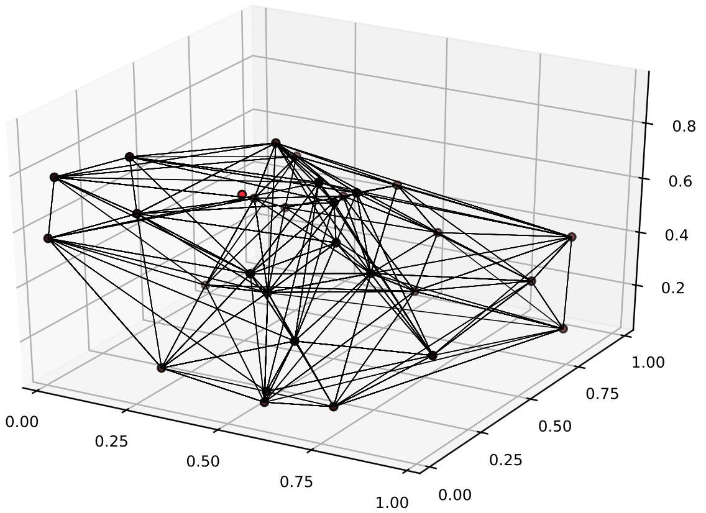

# Invariant measure estimation

## Rectangular partitions

```@docs
invariantmeasure(data, binning_scheme::RectangularBinning)
```

## Triangulated partitions

Say we have a 3D delay reconstruction that we have partioned into simplices.



There are two methods that approximates invariant measures over that partition.

### Exact simplex intersections

```@docs
invariantmeasure(pts, ϵ::TriangulationBinning, simplex_intersection_type::ExactIntersection)
```

### Approximate simplex intersections

```@docs
invariantmeasure(pts, ϵ::TriangulationBinning, simplex_intersection_type::ApproximateIntersection; n::Int = 100, sample_randomly::Bool = false)
```