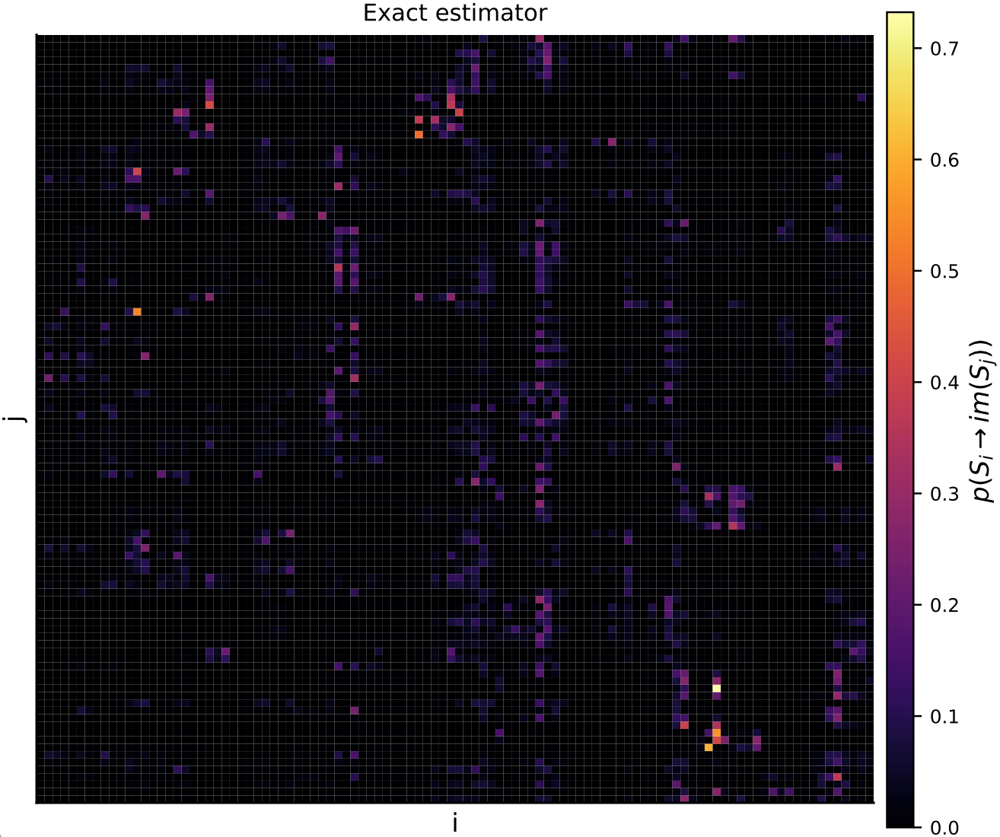
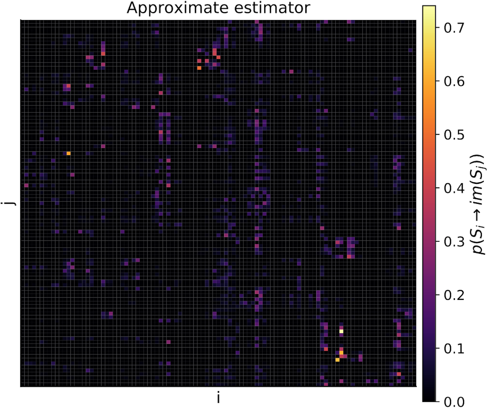

# Transfer operator estimation

## Rectangular partitions

```@docs
transferoperator(points, binning_scheme::RectangularBinning; kwargs...)
```

## Triangulated partitions

Say we have a 3D delay reconstruction that we have partioned into simplices.


There are two methods that approximate the transfer operator over such a partition.

### Exact simplex intersections

```@docs
transferoperator(pts, ϵ::TriangulationBinning, simplex_intersection_type::ExactIntersection)
```

#### Visualising a transfer matrix computed using exact simplex intersections

Say the delay embedding for which we constructed a triangulated partition above was constructed 
from some time series. The transfer operator for the partition above is just a square matrix giving the probabilities of jumping between states of the partition (regardless of the dimension of the attractor over which it is approximated), so we can visualise it as a heatmap. Here, we show the probabilities of 
jumping between states ``S_i`` to all other states ``S_j``. 

Each state is simply the volume spanned by a simplex of the partition, and the transition probabilities are computed as the overlap of volumes when projecting the simplices one step ahead in time according to the time ordering of the original points of the delay reconstruction.




### Approximate simplex intersections

```@docs
transferoperator(pts, ϵ::TriangulationBinning, simplex_intersection_type::ApproximateIntersection; n::Int = 200, sample_randomly::Bool = false)
```

#### Visualising a transfer matrix computed using approximate simplex intersections

