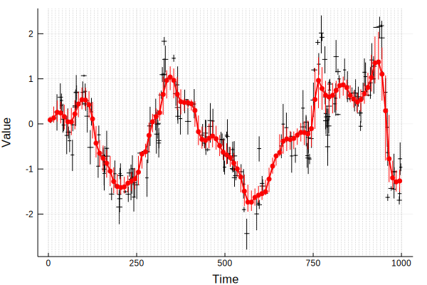
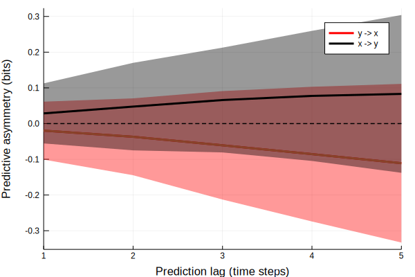

# [Tutorial: BinnedResampling with RandomSequencesTest and PredictiveAsymmetryTest](@id tutorial_BinnedResampling_RandomSequencesTest_PredictiveAsymmetryTest_ar1_unidir)

## Problem

My data are uncertain and not equally spaced in time. I must convert my data to a regular time grid, so that I can perform causality analyses. I then want to run causality tests on random subsampled chunks of my binned dataset.

## One solution

Load necessary packages.

```julia
using UncertainData, Plots, CausalityTools, DynamicalSystemsBase
```

### Example time series

Generate some points with uncertainties.

```julia
npts = 200

# Create `npts` time steps randomly distributed between 1 and 500,
# and add time uncertainties.
time = sort(rand(1:1000, npts))
ts = [UncertainValue(Normal(t, rand(Uniform(10, 20)))) for t in time]
    
# Generate some time series of length `npts` and add measurement uncertainties.
sys = CausalityTools.ar1_unidir(c_xy = 0.7)
xs, ys = columns(trajectory(sys, npts - 1))
x = UncertainIndexValueDataset(ts, [UncertainValue(Normal(x, rand())) for x in xs])
y = UncertainIndexValueDataset(ts, [UncertainValue(Normal(y, rand())) for y in ys])

# Draw 300000 independent samples in total (from time and values simultaneously)
# from the data. Based on the value of the time draws, distribute the value 
# draws in bins that are 20 time steps wide and covers the interval [0, 1000].
# For each bin, create a new value distribution that has no time uncertainty 
# (assuming equiprobable time within each bin) and a new uncertainty distribution
# in the values. The new distributions are KDE estimates to the distributions 
# in each bin, hence the large number of samples.
left_bin_edges = 0:10:1000
bin_instructions = BinnedResampling(left_bin_edges, 100000)
x_binned = resample(x, bin_instructions)
y_binned = resample(y, bin_instructions)
```

Plot the original data, the binned data and the bin grid.

```julia
plot(xlabel = "Time", ylabel = "Value")
plot!(x, marker = stroke(0.01, :red), ms = 1, c = :red, label = "x")
plot!(x_binned,  marker = stroke(0.01, :red), ls = :dash, ms = 4, c = :red, label = "")
plot!(median.(x_binned.indices), median.(x_binned.values), lw = 2, c = :red, label = "")

vline!(left_bin_edges, c = :grey, lw = 0.5, lα = 0.5, ls = :dash, label = "")
```



## Test setup

Define some causality tests.

```julia
te_test = VisitationFrequencyTest(ηs = -5:5, binning = RectangularBinning(4))
pa_test = PredictiveAsymmetryTest(te_test)
```

## Analysis

Now, run the causality test on random subsampled time-consecutive chunks of the binned data.

```julia
# Run the causality test on 500 random subsampled chunks of lengths
# length(x_binned)-20 to length(x_binned)-1. Every time a chunk gets
# sampled, an independent realisation of the uncertain dataset is 
# drawn. Hence, to get 500 random realisations of the dataset within
# the uncertainties, we need to sample 500 different chunks.
L = length(x_binned)
ra_test = RandomSequencesTest(pa_test, RandomSequences(100, L-20:L-1))

# Compute predictive asymmetry in both directions.
pa_xy = causality(x_binned, y_binned, ra_test)
pa_yx = causality(y_binned, x_binned, ra_test)
```

## Results

Plot the results.

```julia
xys = hcat(pa_xy...)
yxs = hcat(pa_yx...)

plot(xlabel = "Prediction lag (time steps)", ylabel = "Predictive asymmetry (bits)", xlims = (1, 5))
plot!(1:5, mean(yxs, dims=2), ribbon = std(yxs, dims = 2), lw = 3,
    label = "y -> x", fα = 0.4, c = :red)
plot!(1:5, mean(yxs, dims=2), lw = 3, label = "")
plot!(1:5, mean(xys, dims=2), ribbon = std(xys, dims = 2), lw = 3, 
    label = "x -> y", fα = 0.4, c = :black)
hline!([0], lw = 1.5, ls = :dash, c = :black, label = "")
```



## Discussion

As expected, we get nice separation into positive values for the causal direction (x to y) and separation to negative values for the non-causal direction (y to x).