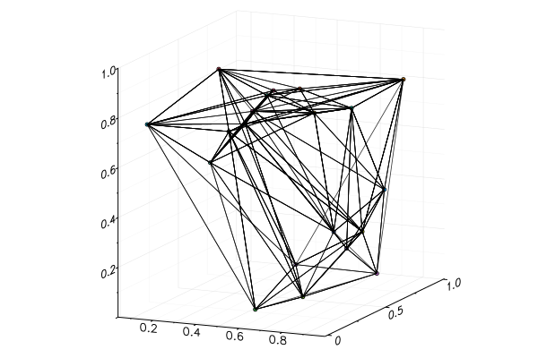

# Discretization schemes

## Rectangular

Across the package, there are many functions that accept the `ϵ` argument.
This is an indication that the underlying algorithm in some way involves a box
discretization of a set of points or a delay embedding.  

### Controlling the partitioning

Currently, there are four different ways of partitioning an embedding.
The discretization scheme is controlled by `ϵ`, and the following `ϵ` will work:

* `ϵ::Int` divides each axis into `ϵ` intervals of the same size.
* `ϵ::Float` divides each axis into intervals of size `ϵ`.
* `ϵ::Vector{Int}` divides the i-th axis into `ϵᵢ` intervals of the same size.
* `ϵ::Vector{Float64}` divides the i-th axis into intervals of size `ϵᵢ`.


## Triangulations

Another way of discretize is to triangulate the convex hull of the points into disjoint
simplices. This can be done using a member of the family of `triangulate` functions,
which are listed below. Valid inputs are `AbstractArray{T, 2`} (the largest
dimension will be taken as the index), `Vector{Vector}`, `Vector{SVector}`, `Vector{MVector}`
(each vector is a point) or a `Dataset` from [`DynamicalSystems.jl`](https://juliadynamics.github.io/DynamicalSystems.jl/latest/).

For 3D triangulations, plot recipes available.

### Example

```julia
pts = [rand(3) for i = 1:20]
t = triangulate(pts)
plot(t)
```



### More examples

The following examples demonstrate the different ways of constructing triangulations
on different input data.

``` julia tab="Triangulation"
# Create some random points
pts1 = [rand(3) for i = 1:20]
pts2 = hcat(pts1...,)
pts3 = transpose(hcat(pts1...,))
pts4 = [SVector{3, Float64(x)} for x in pts1]
pts5 = [MVector{3, Float64(x)} for x in pts1]
pts6 = Dataset(pts1)

# Create a basic triangulation containing only the points and the simplices (expressed
# as vertex indices in terms of the points).
t1 = triangulate(pts1) # -> PointTriangulation
t2 = triangulate(pts2) # -> MatrixTriangulation
t3 = triangulate(pts3) # -> MatrixTriangulation
t4 = triangulate(pts4) # -> PointTriangulation
t5 = triangulate(pts5) # -> PointTriangulation
t6 = triangulate(pts6) # -> DatasetTriangulation
```

``` julia tab="Mutable triangulation"
# Create some random points
pts1 = [rand(3) for i = 1:20]
pts2 = hcat(pts1...,)
pts3 = transpose(hcat(pts1...,))
pts4 = [SVector{3, Float64(x)} for x in pts1]
pts5 = [MVector{3, Float64(x)} for x in pts1]
pts6 = Dataset(pts1)

# Create a basic triangulation containing only the points and the simplices (expressed
# as vertex indices in terms of the points).
t1 = triangulate_m(pts1) # -> MutablePointTriangulation
t2 = triangulate_m(pts2) # -> MutableMatrixTriangulation
t3 = triangulate_m(pts3) # -> MutableMatrixTriangulation
t4 = triangulate_m(pts4) # -> MutablePointTriangulation
t5 = triangulate_m(pts5) # -> MutablePointTriangulation
t6 = triangulate_m(pts6) # -> MutableDatasetTriangulation
```

``` julia tab="Full triangulation"
# Create some random points
pts1 = [rand(3) for i = 1:20]
pts2 = hcat(pts1...,)
pts3 = transpose(hcat(pts1...,))
pts4 = [SVector{3, Float64(x)} for x in pts1]
pts5 = [MVector{3, Float64(x)} for x in pts1]
pts6 = Dataset(pts1)

# Create a full triangulation containing the points, simplices and information about
# the simplices.
t1 = triangulate_f(pts1) # -> PointTriangulationFull
t2 = triangulate_f(pts2) # -> MatrixTriangulationFull
t3 = triangulate_f(pts3) # -> MatrixTriangulationFull
t4 = triangulate_f(pts4) # -> PointTriangulationFull
t5 = triangulate_f(pts5) # -> PointTriangulationFull
t6 = triangulate_f(pts6) # -> DatasetTriangulationFull
```

``` julia tab="Mutable full triangulation"
# Create some random points
pts1 = [rand(3) for i = 1:20]
pts2 = hcat(pts1...,)
pts3 = transpose(hcat(pts1...,))
pts4 = [SVector{3, Float64(x)} for x in pts1]
pts5 = [MVector{3, Float64(x)} for x in pts1]
pts6 = Dataset(pts1)

# Create a mutable full triangulation containing the points, simplices and information about
# the simplices.
t1 = triangulate_mf(pts1) # -> MutablePointTriangulationFull
t2 = triangulate_mf(pts2) # -> MutableMatrixTriangulationFull
t3 = triangulate_mf(pts3) # -> MutableMatrixTriangulationFull
t4 = triangulate_mf(pts4) # -> MutablePointTriangulationFull
t5 = triangulate_mf(pts5) # -> MutablePointTriangulationFull
t6 = triangulate_mf(pts6) # -> MutableDatasetTriangulationFull
```


### Documentation

#### Basic triangulation

```@docs
triangulate
```

#### Basic, mutable triangulation

```@docs
triangulate_m
```

#### Full triangulation

```@docs
triangulate_f
```

#### Full, mutable triangulation

```@docs
triangulate_mf
```
