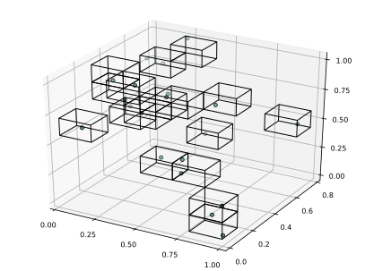

# Invariant measure estimation

### Rectangular grid

`RectangularInvariantMeasure` is a composite type holding all information used to estimate 
an invariant measure for a rectangular partition, and is constructed using the 
`rectangularinvariantmeasure` estimator, which takes two arguments: the set of points from 
which to estimate the measure, and a [binning scheme](../../glossary/dicretization.md) `ϵ`.

### Example 

```julia 
# Create a few random points (this is just for illustration, you wouldn't want to use 
# a rectangular estimator for the invariant measure for this few points; in that case, 
# use one of the triangulation estimators!)
pts = [rand(3) for i = 1:20]

# Find the invariant measure using a rectangular partition with edge lengths derived from
# deviding the 1st, 2nd and 3rd coordinate axes into 5, 6 and 7 equally spaced intervals.
rect_measure = rectangularinvariantmeasure(pts, [5, 6, 7])
```

There's a simple plot recipe for visualizing which bins have nonzero measure.

```julia 
# Plot the boxes with nonzero measure, along with the points the measure was estimated from
plot(rect_measure)
```



### Documentation

```@docs
rectangularinvariantmeasure
```
